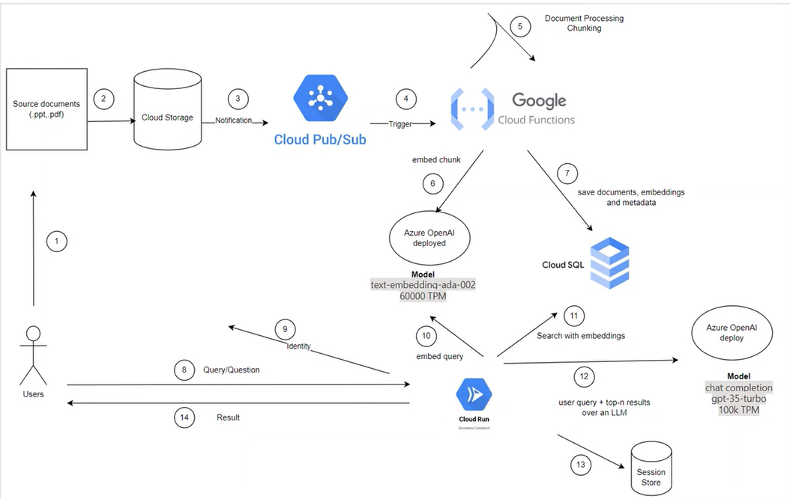

# RAG bot

LLMs are prone to hallucination.

To avoid hallucination, we use RAG technology. It enables an LLM to understand the `externalcontext` and use this private knowledge for doing tasks.

## Generator Part

1. Document ingestion
2. Processing (split and chunk)
3. Document embedding
4. saving embeddings to Vector DB

## Retrieval Part

1. User query embedding
2. similarity search of query, and retrieval from DB
3. enhanced/refined query (with the retrieved context) with LLM (e.g. openai)
4. response generation
5. session and conversation storage

## Implementation on GCP

1. Documents in Buckets
2. Processing happens using Pub/Sub architecture and cloud functions
3. Save embeddings into vector DB

